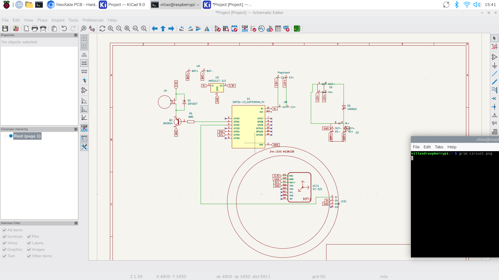

# NeoXalle-Hardware

Hardware side of the Neoxalle reaction training system.

This repository contains the electronics design and wiring references used to build the Neoxalle nodes. Each node acts as a standalone reaction target with lights, motion sensing, and vibration feedback. The goal of the project is to create something similar to BlazePods but open and customizable.

### [Watch this video on YouTube](https://youtu.be/leAVq9ZJ1fE)

Each Neoxalle unit is built around an ESP32-C3 microcontroller. The device controls LEDs, reads motion sensors, and triggers vibration motors depending on what the software requests.

The nodes are meant to be used in reaction training games where users hit or move the device when it lights up.

Main functions:

LED feedback for visual signals
Impact detection using an accelerometer
Vibration motor for feedback
Battery powered operation
Communication with the Neoxalle app (another repository for that)

The hardware was designed to stay simple and inexpensive while still being responsive enough for sports training.

Hardware

Current prototype uses the following components:

Slaves
  ESP32-C3 - 5V
  MPU6050 accelerometer  SDA gpio5 SCL gpio4 (Use 3.3v output from the 3.3v voltage regulator)
  WS2812b 24b / NeoPixel LED ring (solder a 16v 250uf condensator to gnd a 5v)
  Coin vibration motor (connect a 2n3904 transistor and a diode with the motor in parallel)
  5V 1A battery charging module 
  3.7V 1200 mAh LiPo battery
  12V - 5V step-down / voltage regulation
  5V - 3.3V step-down / voltage regulation
  Pogo Pins round magnetic 4 pins
  ABS Case And Lid (SLAVE) 3D print

Master 
ESP32-S3
 ABS Case And Lid (Master) 3D print

Most of the components are easy to find on AliExpress or similar electronics suppliers.

Basic Architecture

Follow the schematic for more detailed tutorial.

Battery
→ Charging module
→ Voltage regulation
→ ESP32 + sensors + LEDs + motor

The ESP32 handles:

sensor reading
hit detection
LED control
game logic

Impact detection is intentionally simple for now: it mostly looks at sudden acceleration spikes from the top direction rather than full motion tracking.

FIRMWARE 

Connect the ESP32c3 to arduino IDE and upload the Slave V2 code.
Connect the ESP32s3 to arduino IDE and upload the Master V2 code.

Project Status

Still a prototype.

Things that work:
LED signaling
impact detection
vibration feedback
basic standalone reaction mode

Things still being improved:

sensor filtering
power efficiency
enclosure design
communication with the Neoxalle mobile app

BOM 

| ITEM                    | PRICE $ | QUANTITY | PURPOSE              | LINK                                                                                                                                                                                                                              |
|-------------------------|---------|----------|----------------------|-----------------------------------------------------------------------------------------------------------------------------------------------------------------------------------------------------------------------------------|
| ESP32C3                 | 3.87    | 2        | MCU                  | https://es.aliexpress.com/item/1005005319963906.html                                                                                                                                                                              |
| MPU6050                 | 2.65    | 2        | Accelerometer        | https://es.aliexpress.com/item/1005008796700745.html                                                                                                                                                                              |
| Li-on Battery (1200mah) | 21.22   | 2        | Power                | https://es.aliexpress.com/item/1005011601135401.html                                                                                                                                                                              |
| LED Ring                | 6.59    | 2        | Visuals              | https://es.aliexpress.com/item/1005011810508134.html                                                                                                                                                                              |
| 5V Battery Charger      | 3.29    | 2        | Power                | https://es.aliexpress.com/item/1005010275198186.html                                                                                                                                                                              |
| Pogo Pins - Male        | 5       | 2        | Charging System      | https://es.aliexpress.com/item/1005010526681879.html                                                                                                                                                                              |
| Pogo PIns - Female      | 5       | 2        | Charging System      | https://es.aliexpress.com/item/1005010526681879.html                                                                                                                                                                              |
| 3D Print - Top          | 0       | 2        | Structure            | https://cad.onshape.com/documents/914ab1e3f9de5857bd04cad5/w/fe3775e11ed4b5ce7c2d1721/e/2a4a9405b78e8a972a361091https://cad.onshape.com/documents/914ab1e3f9de5857bd04cad5/w/fe3775e11ed4b5ce7c2d1721/e/2a4a9405b78e8a972a361091  |
| 3D Print - Base         | 0       | 2        | Structure            | https://cad.onshape.com/documents/914ab1e3f9de5857bd04cad5/w/fe3775e11ed4b5ce7c2d1721/e/2a4a9405b78e8a972a361091https://cad.onshape.com/documents/914ab1e3f9de5857bd04cad5/w/fe3775e11ed4b5ce7c2d1721/e/2a4a9405b78e8a972a3610911 |
| 1N4007 Diode            | 0.99    | 2        | One way Charging     | https://es.aliexpress.com/item/1005009923993443.html                                                                                                                                                                              |
| AMS1117 - 3.3V          | 7.36    | 2        | MPU6050 Power Supply | https://es.aliexpress.com/item/1005011601159722.html                                                                                                                                                                              |
| M3 Screws               | 0.99    | 4        | Assembly             | https://es.aliexpress.com/item/1005011821173994.html                                                                                                                                                                              |
| M3 Nuts                 | 0.99    | 4        | Assembly             | es.aliexpress.com/item/1005006071488810.html                                                                                                                                                                                      |

Goal of the Project

The idea behind Neoxalle is to build a fully customizable reaction training system without being locked into expensive commercial hardware.
Commercial systems like BlazePods are great, but they are expensive and closed. This project tries to recreate similar functionality using open hardware so it can be modified, studied, and improved.

Notes

This is a personal project and the hardware design changes often as new versions are tested.
If something in the repo looks messy, it probably means it's still being experimented with.
